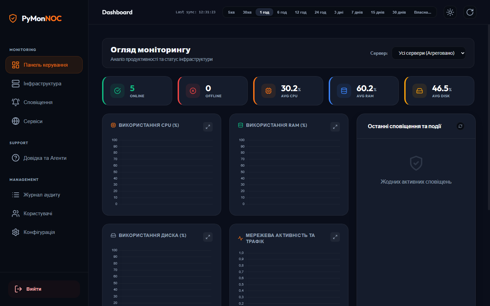
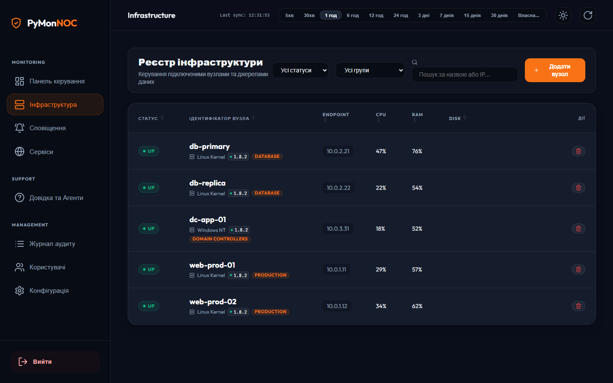
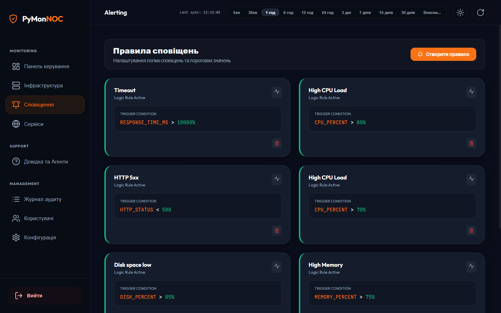
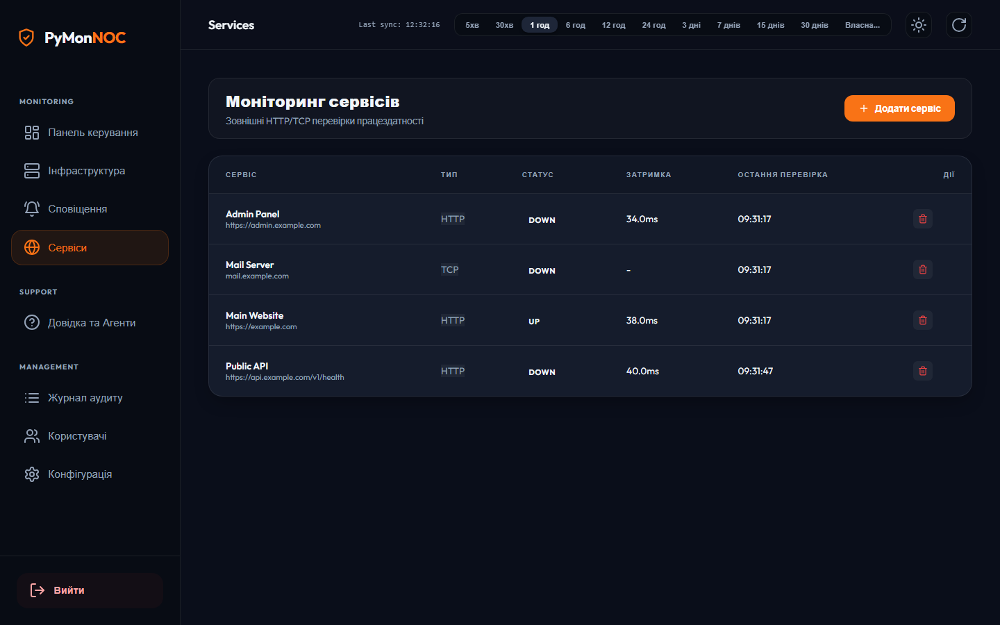

<div align="center">

# PyMon NOC

### Enterprise Infrastructure Monitoring & NOC Dashboard


Легка, швидка та сучасна платформа моніторингу інфраструктури для Linux, Windows та macOS — з панеллю керування у стилі Grafana, збором метрик у реальному часі та гнучкими сповіщеннями.

[🌐 Live Demo](https://ajjs1ajjs.github.io/Monitoring/) · [📖 Documentation](#-документація)

[](https://go.dev)
[](LICENSE)
[]()
[](CHANGELOG.md)

[](https://github.com/ajjs1ajjs/Monitoring/actions/workflows/ci.yml)

</div>
---

## 🖼️ Screenshots

<p align="center">
  
  
  
  
</p>

<p align="center">
  
</p>

---

## 📑 Зміст

- [Основні можливості](#-основні-можливості)
- [Швидкий старт](#-швидкий-старт)
- [Розгортання агентів](#-розгортання-агентів)
- [Команди](#-команди)
- [Конфігурація та змінні середовища](#️-конфігурація-та-змінні-середовища)
- [Безпека](#-безпека)
- [Документація](#-документація)
- [Технології](#-технології)

---

## ✨ Основні можливості

- **Професійний NOC Dashboard** — сучасний інтерфейс у темній темі з потоковою передачею метрик (WebSocket) та індикаторами здоров'я.
- **Моніторинг серверів** — CPU, RAM, диски та мережа через `node_exporter` (Linux).
- **Моніторинг сервісів** — зовнішні перевірки HTTP / TCP / Ping / SSL (Blackbox) для сайтів та API.
- **Сповіщення** — Telegram, Discord, MS Teams, Slack, Email (SMTP).
- **Міграція з Prometheus** — імпорт наявних `prometheus.yml` (сервери та сервіси) прямо в інтерфейсі.
- **Режим обслуговування** — тимчасове відключення сповіщень для вузлів під час планових робіт.
- **Alerting rules** — гнучкі правила на CPU/RAM/диск з дебаунсингом за тривалістю.
- **Звіти про здоров'я** — генерація 24-годинних звітів із графіками (PDF через друк).
- **Бекапи** — автоматичні за розкладом (cron) та ручні, з відновленням.
- **PWA** — встановлення дашборду на мобільний як окремий застосунок.

---

## 🚀 Швидкий старт

### 1. Сервер моніторингу

**Ubuntu / Debian** (одна команда і встановлює, і оновлює):
```bash
curl -sSL https://raw.githubusercontent.com/ajjs1ajjs/Monitoring/main/install.sh | sudo bash
```

Або збірка з сирців:
```bash
./run.sh --port 10000
```

> **Одна й та сама команда** і встановлює, і оновлює. Скрипт сам визначає режим.

**Windows** (PowerShell від імені адміністратора; одна команда і встановлює, і оновлює):
```powershell
irm https://raw.githubusercontent.com/ajjs1ajjs/Monitoring/main/install.ps1 | iex
```

Реєструється як служба Windows (`PyMonNOC`, автозапуск), запускається під `NT AUTHORITY\NetworkService`. Дані та конфіг зберігаються в `%ProgramData%\PyMon` і **не видаляються** при повторному запуску скрипта (оновлення бінарника).

**macOS** (Apple Silicon та Intel):
```bash
curl -sSL https://raw.githubusercontent.com/ajjs1ajjs/Monitoring/main/install.sh | sudo bash
```

Встановлюється як LaunchDaemon (`com.pymon.pymon`), дані в `/var/lib/pymon`.

### 🔁 Встановлення vs Оновлення

| | Встановлення (перший запуск) | Оновлення (повторний запуск) |
|---|---|---|
| Бінарник | завантажується з GitHub Releases | замінюється на новий |
| Конфіг `/etc/pymon/config.yml` | створюється з прикладу | **зберігається без змін** |
| База даних `/var/lib/pymon/pymon.db` | створюється | **зберігається без змін** |
| Користувачі та паролі | створюється адмін | **зберігаються без змін** |
| Старий бінарник | — | зберігається як `pymon.old` (відкат) |
| Служба `systemd` | створюється та запускається | перезапускається |

**Відкат після оновлення** (якщо щось пішло не так):
```bash
sudo systemctl stop pymon
sudo install -m 0755 /opt/pymon/pymon.old /opt/pymon/pymon
sudo systemctl start pymon
```

**Встановлення конкретної версії:**
```bash
PYMON_VERSION=v3.0.0 curl -sSL https://raw.githubusercontent.com/ajjs1ajjs/Monitoring/main/install.sh | sudo bash
```

### 🗝️ Перший вхід (пароль адміна)

При **першому** встановленні скрипт генерує пароль і друкує його прямо у висновку:

```
====================================
  Логін:    admin
  Пароль:   <згенерований>
====================================
```

Пароль також зберігається одноразово у `/var/lib/pymon/admin_password.txt` (права 0600):
```bash
sudo cat /var/lib/pymon/admin_password.txt
sudo rm /var/lib/pymon/admin_password.txt    # видаліть після входу
```

**Втратили пароль або хочете свій** — скиньте:
```bash
sudo PYMON_ADMIN_PASSWORD='YourStrongPass123' /opt/pymon/pymon reset-admin --config /etc/pymon/config.yml
sudo systemctl restart pymon
# Логін: admin / YourStrongPass123
```

> 💡 При першому вході дашборд попросить **змінити пароль** перед використанням (це стандартний flow `must_change_password`). Після зміни — інтерфейс повністю активний.

### 🌐 Порти та фаєрвол

- Дашборд слухає **TCP 10000** (можна змінити у `config.yml` → `server.port`).
- Якщо браузер на іншій машині — відкрийте порт:
  ```bash
  sudo ufw allow 10000/tcp
  ```

### 2. Перевірка

```bash
curl http://localhost:10000/api/v1/health   # {"status":"ok"}
```

---

## 📡 Розгортання агентів

**Linux Node** (`node_exporter`):
```bash
curl -sSL https://github.com/prometheus/node_exporter/releases/latest/download/node_exporter-*.linux-amd64.tar.gz -o ne.tar.gz
tar xzf ne.tar.gz && ./node_exporter/node_exporter &
```

Далі додайте вузол у дашборді (**Servers → Add**) або імпортуйте `prometheus.yml`.

---

## 🔧 Команди

### Linux (systemd)
```bash
sudo systemctl start|stop|restart|status pymon
sudo journalctl -u pymon -f        # якщо journalctl доступний

# Оновлення = та сама команда встановлення
curl -sSL https://raw.githubusercontent.com/ajjs1ajjs/Monitoring/main/install.sh | sudo bash

# Прямий запуск з сирців (для розробки)
./run.sh --port 10000
```

### Скидання пароля адміна
```bash
# Задати конкретний пароль (через sudo, бо файли належать pymon)
sudo PYMON_ADMIN_PASSWORD='YourStrongPass123' /opt/pymon/pymon reset-admin --config /etc/pymon/config.yml
sudo systemctl restart pymon
```

### Windows (служба)
```powershell
Start-Service PyMonNOC ; Stop-Service PyMonNOC ; Restart-Service PyMonNOC
Get-Service PyMonNOC
Get-EventLog -LogName Application -Source PyMonNOC -Newest 20   # якщо служба пише в Event Log

# Оновлення = та сама команда встановлення
irm https://raw.githubusercontent.com/ajjs1ajjs/Monitoring/main/install.ps1 | iex
```

**Скидання пароля адміна (Windows):**
```powershell
$env:PYMON_ADMIN_PASSWORD = "YourStrongPass123"
& "$env:ProgramFiles\PyMon\pymon.exe" reset-admin --config "$env:ProgramData\PyMon\config.yml"
Restart-Service PyMonNOC
```

---

## ⚙️ Конфігурація та змінні середовища

Конфігурація — у `config.yml` (за зразком [`config.example.yml`](config.example.yml)). Файл `config.yml` у `.gitignore` — **не комітьте секрети в git**.

| Змінна | Призначення | За замовчуванням |
|--------|-------------|------------------|
| `JWT_SECRET` | Ключ підпису JWT (мін. 32 символи). Задавайте на проді, щоб токени переживали рестарт. | авто → `.pymon_jwt_secret` |
| `PYMON_ADMIN_PASSWORD` | Початковий/скидальний пароль адміна. | випадковий (показ один раз) |
| `CONFIG_PATH` | Шлях до конфіга. | `config.yml` |
| `DB_PATH` | Шлях до бази (перекриває конфіг). | з `config.yml` |
| `DATA_DIR` / `LOG_DIR` | Директорії даних і логів. | `.` |
| `PYMON_ALLOW_METADATA` | Дозволити скрейп cloud-метаданих (`169.254.169.254`). | `false` |
| `PYMON_ALLOWED_ORIGINS` | Cross-origin allowlist для API та WebSocket (CSWSH-захист), через кому. Порожньо = same-origin. | порожньо |

Повний приклад — [`.env.example`](.env.example).

---

## 🔒 Безпека

- **Пароль адміна показується лише один раз** — при першому створенні або після `reset-admin`. Він **ніколи не зберігається у відкритому вигляді** — у базі лежить тільки bcrypt-хеш. Втратили — виконайте `pymon reset-admin`.
- **Дефолтного пароля в коді немає.** За порожнього/слабкого значення в `config.yml` на першому запуску генерується сильний випадковий пароль (можна задати через `PYMON_ADMIN_PASSWORD`).
- **Керування інфраструктурою — лише для адмінів.** Створення/зміна/видалення серверів, бекапи (`/backup/*`), очищення журналів і метрик доступні тільки адмінам.
- **API-ключі — лише для інжесту/читання.** Будь-які адмін-дії через `X-API-Key` повертають `403`.
- **Захист від XSS** — усі дані екрануються; хост валідовується суворим whitelist-ом символів.
- **Захист від SSRF** — скрейп відмовляє на адреси cloud-метаданих (вимикач `PYMON_ALLOW_METADATA=true`); приватні LAN-діапазони лишаються дозволеними.
- **Політика пароля** — мінімум 12 символів, верхній + нижній регістр + цифра.

---

## 📚 Документація

| Документ | Опис |
|----------|------|
| [docs/API.md](docs/API.md) | REST API довідка |
| [docs/ARCHITECTURE.md](docs/ARCHITECTURE.md) | Архітектура проекту |
| [docs/TROUBLESHOOTING.md](docs/TROUBLESHOOTING.md) | Усунення несправностей |
| [CHANGELOG.md](CHANGELOG.md) | Журнал змін |
| [MIGRATION_PLAN.md](MIGRATION_PLAN.md) | План міграції Python → Go |

---

## 🧩 Технології

**Бекенд:** Go 1.25 · net/http · SQLite (WAL, modernc.org/sqlite) · gorilla/websocket · golang-jwt · prometheus/common
**Фронтенд:** Vanilla JS · Chart.js · WebSocket · PWA (embedded через `go:embed`)
**Агенти:** Prometheus `node_exporter`

---

<div align="center">
<sub>PyMon NOC · MIT License</sub>
</div>
